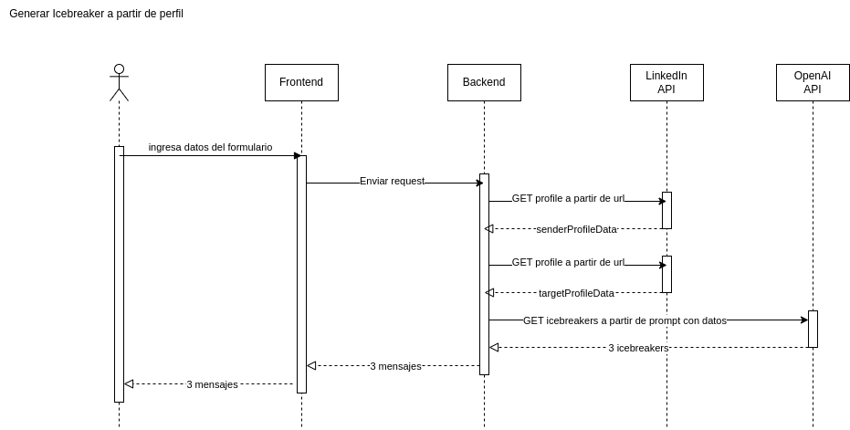
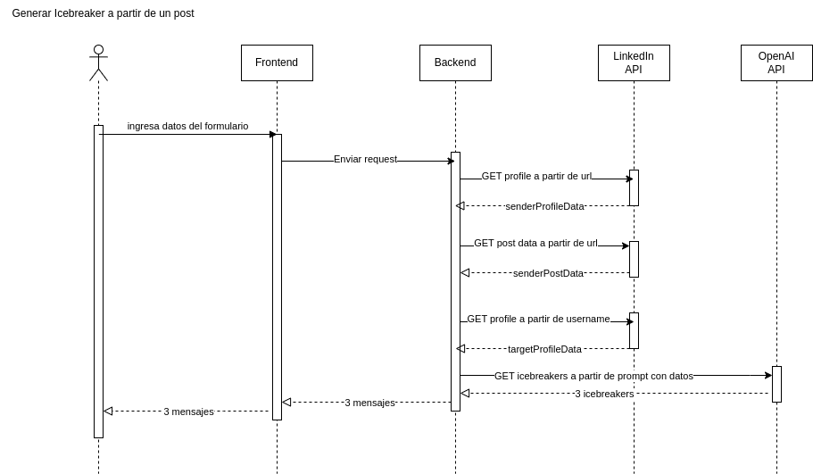

# coldmessages-linkedin
Applicacion fullstack para generacion de Icebreakers para usuarios de LinkedIn, utilizando IA


# Design Document

## Descripción high level del proyecto

#### Objetivo del proyecto:

El objetivo de esta aplicación es ayudar a generar mensajes iniciales (icebreakers) personalizados para conectar con personas en LinkedIn de manera natural y efectiva.

#### Problema que resuelve:

Muchos usuarios de LinkedIn no saben cómo iniciar una conversación con nuevos contactos sin sonar genéricos o forzados. Esto limita las oportunidades de networking, ventas o colaboración.

#### Solución propuesta:

Una aplicación web que, a partir de la URL del emisor, la URL del receptor, el problema que resuelve y la solución que ofrece, genera 3 opciones de mensajes iniciales que suenan humanos, breves y están alineados con el estilo de escritura del emisor y el perfil del destinatario.

#### Componentes principales:

Frontend (React + TypeScript): Formulario para ingresar la información y visualizar los mensajes generados.

Backend (Node.js + TypeScript): API que procesa los datos, consulta APIs externas (como LinkedIn Data API y OpenAI), y devuelve las 3 opciones de mensaje.

#### Interacción típica:
El usuario ingresa la información requerida → el backend analiza perfiles y genera mensajes → el frontend muestra las 3 opciones generadas.

## User Stories con definition of done

1) **User story generacion de icebreakers a partir de perfil:**

    Como usuario de la plataforma
    quiero poder generar 3 icebreakers,
    cargando los inputs correspondientes y el perfil del posoible cliente,
    para enviar como cold message

    Definition of Done:

    - El formulario acepta los siguientes campos: URL del emisor, problema, solución, URL del receptor.
    - Al enviar los datos, se generan 3 icebreakers distintos con tono humano, alineados con el problema descripto y la solucion.
    - Si faltan campos obligatorios, se muestra un mensaje de error claro.
    - El diseño del formulario y los resultados es responsive y legible.
    - La historia está integrada en el frontend y funcional desde el navegador.
    - Se documentó el endpoint correspondiente y su uso en el README.

2) **User story generacion de icebreaker a partir de post:**

    Como usuario de la plataforma
    quiero poder generar 3 icebreakers a partir de un post de una persona,
    cargando los inputs correspondientes y el post del perfil objetivo,
    para enviar como cold message

    Definition of Done:

    - El formulario acepta los siguientes campos: URL del emisor, problema, solución, URL del receptor.
    - Al enviar los datos, se generan 3 icebreakers distintos con tono humano, alineados con el problema descripto y la solucion y relacionado al post que se envio como input
    - Si faltan campos obligatorios, se muestra un mensaje de error claro.
    - El diseño del formulario y los resultados es responsive y legible.
    - La historia está integrada en el frontend y funcional desde el navegador.
    - Se documentó el endpoint correspondiente y su uso en el README.


3) **User story cargado de informacion propia:**

    Como usuario de la plataforma
    quiero poder ingresar información sobre mi perfil y qué solución ofrezco
    para que el mensaje generado tenga un enfoque personalizado y relevante.

    Definition of Done:
    - Se incluye un input para cargar el url del usuario emisor.
    - Se incluye un input para describir brevemente la solución o producto ofrecido.
    - La información es utilizada en la generación del mensaje.
    - Si no se completan estos campos, se advierte al usuario o se usa un prompt genérico.

4) **User Story Personalización del mensaje:**
    Como usuario de la plataforma
    quiero poder previsualizar los icebreakers generados antes de enviarlos
    para elegir el que mejor se adapte al tono y contexto que deseo comunicar.

    Definition of Done:

    - Se generan al menos 3 icebreakers distintos.
    - Los icebreakers se muestran en la interfaz al usuario en un formato claro.
    - El usuario puede seleccionar uno para copiarlo fácilmente.
    - Los mensajes no contienen errores de gramática ni están fuera de contexto.

## Disenio general

### Componentes del sistema

#### Frontend (React + Typescript)

- Formulario con los 4 inputs:
    - URL de perfil de LinkedIn del emisor
    - Problema que resuelve
    - Solución ofrecida
    - URL del perfil destino -> Se puede enviar una url al perfil de usuario o una url a alguno de sus Posts que se desee responder

- Botón para generar icebreakers

- Muestra los 3 mensajes generados

- Estado de carga / errores

#### Backend (Node.js)

Funcion generate-icebreakers

- Valida inputs
- Llama a LinkedIn API para obtener datos del perfil emisor
- Llama a LinkedIn API para obtener datos del perfil destinatario
- Crea prompt con la info recopilada
- Llama a la OpenAI API para generar los icebreakers, especificando problema a resolver y solucion ofrecida
- Devuelve los 3 mensajes generados

#### Flujo de datos
- Usuario completa el formulario y hace submit.
- Frontend envía un POST al backend con los datos.

- Backend:
    - Extrae datos del perfil emisor desde la LinkedIn API.
    - Extrae datos del perfil receptor desde la LinkedIn API.
    - Construye un prompt usando los datos del perfil receptor + emisor + problema/solución.
    - Llama a OpenAI API.
    - Recibe y devuelve los 3 icebreakers al frontend.

- Frontend muestra los resultados.

#### Manejo de errores
- Inputs obligatorios validados en frontend y backend.
- Si LinkedIn API falla → mostrar error específico.
- Si OpenAI falla → mostrar mensaje genérico al usuario.
- Loading spinner para mejorar UX.

## Link a v0

https://v0.dev/chat/linkedin-message-generator-2ESuJkRH7dr

## External dependencies

- **OpenAI API**  
  Utilizada para generar los icebreakers personalizados mediante modelos de lenguaje (GPT-4 Turbo). Se accede a través de una API key privada.

- **LinkedIn Data API (RapidAPI)**  
  Utilizada para obtener información del perfil de LinkedIn del destinatario (nombre, headline, publicaciones, etc.). Requiere clave de autenticación en RapidAPI.

- **V0.dev**  
  Utilizado para generar componentes de frontend rápidamente con Shadcn/UI y acelerar el desarrollo visual.


## Costos

### OpenAI API
- Se utiliza el modelo `gpt-4-turbo`, que actualmente tiene un costo aproximado de:
  - **$0.01 por 1K tokens de input**
  - **$0.03 por 1K tokens de output**
- Cada generación de 3 mensajes consume aproximadamente entre 300 y 800 tokens, dependiendo del prompt y la respuesta.
- Costo estimado por cada llamada: **entre $0.01 y $0.03 USD**

### LinkedIn Data API (RapidAPI)
- Plan gratuito disponible con límite de requests. 

### Infraestructura y Base de datos
- La aplicación fue desarrollada como un frontend + backend dentro de un mismo proyecto Next.js. No se utilizan bases de datos ni almacenamiento externo, por lo tanto no hay costos asociados a infraestructura.


## Arquitectura de Datos

Dado que la aplicación no utiliza una base de datos, los datos se manejan directamente en las solicitudes y respuestas entre el frontend y el backend. A continuación, se detalla la estructura de los datos enviados y recibidos:

### Datos enviados al backend (POST `/api/generate-icebreakers`)

El frontend envía un objeto JSON con la siguiente estructura:

```json
{
  "senderProfileUrl": "https://www.linkedin.com/in/tu-perfil",
  "problem": "Describe el problema que resuelves para tus clientes",
  "solution": "Describe la solución que ofreces",
  "targetProfileUrl": "https://www.linkedin.com/in/perfil-destino"
}
```

El backend devuelve un objeto JSON con los mensaes generados:
```json
{
  "messages": [
    "Mensaje generado 1",
    "Mensaje generado 2",
    "Mensaje generado 3"
  ]
}
```

En caso de que haya un error, el backend devuelve objego JSOn con el mensaje de error:
```json
{
  "error": "Descripción del error ocurrido"
}

```

## API Reference

#### OpenAI API

Utilizacion de API de OpenAI
- POST request enviando el prompt con su respectiva data adjunta

Utilizacion de API de LinkedIn
- GET Profile Data By Url -> Obtener la data general del perfil.
- GET Profile Post -> Obtener el texto del post que hizo un perfil target
- GET Profile Data -> Obener la data general del perfil a partir del username
- GET Profile's Posts -> Obtener los posts para buscar informacion relevante
- GET Profile's Comments -> Obtener los comentarios que realizo el usuario en distintos posts

## High level sequence diagrams

Ejemplos de flujos de ejecucion:





## Error handling (handling and user feedback)

#### Errores del lado del cliente
- Se maneja el error en caso de que falten campos obligatorios. Se imprime el mensaje: `"Por favor completa todos los campos"`
- Se maneja el error en caso de que las url proporcionadas sean incorrectas o inexistentes. 
Si la url del perfil emisor es incorrecta, se imprime el mensaje: `"El perfil del remitente no existe o no se pudo obtener"`.
Si la url del perfil destino es incorrecta, ya sea porque no existe el url de ese perfil o no existe esa url de una post particular, se imprime el mensaje: `"La url del perfil objetivo no existe o no se pudo obtener"`.


#### Errores del lado del servidor
- Se retorna un código HTTP adecuado (`400` para errores de validación, `500` para errores internos).
- Los errores se registran en consola para debugging, pero **no se exponen al usuario final**.


## Non functional requirements (rate limiting, platform limits, etc)

#### Rendimiento
- La generación de icebreakers debe completarse en menos de 20 segundos en condiciones normales.
- Se muestra feedback visual inmediato (spinner) para evitar que el usuario piense que la app está congelada.

#### Seguridad
- Las claves API (OpenAI y LinkedIn Data API) deben almacenarse en variables de entorno y nunca ser expuestas en el cliente.
- No se almacena información sensible del usuario ni del receptor.

#### Usabilidad
- La interfaz debe ser clara, intuitiva y simple.
- Los estados de error y éxito se comunican al usuario con mensajes descriptivos y visuales.

#### Disponibilidad
- Estolerante a fallas externas (por ejemplo, que falle la API de LinkedIn sin romper toda la app).
- No requiere base de datos ni almacenamiento persistente, por lo que no hay riesgo de downtime por esa vía.

#### Portabilidad
- Puede ser ejecutado en cualquier entorno compatible con Node.js.
- No depende de ningún sistema operativo específico para su ejecución.


## Product analytics (eventos y que gráficos vamos a tener)

### Eventos a trackear
1. **Formulario completado**
   - Qué: el usuario completó todos los campos y envió el formulario.
   - Para qué: medir intención real de generar un mensaje.

2. **Mensajes generados exitosamente**
   - Qué: el backend devolvió 3 icebreakers sin errores.
   - Para qué: evaluar tasa de éxito general y calidad del servicio.

3. **Mensaje copiado**
   - Qué: el usuario hizo click en el botón “Copiar al portapapeles”.
   - Para qué: identificar qué mensajes resultan más útiles o accionables.

4. **Verificación de perfiles**
   - Qué: el usuario verificó la validez de una URL de LinkedIn.
   - Para qué: entender el comportamiento de validación y calidad de datos.

5. **Errores en generación**
   - Qué: hubo un fallo al conectar con la API de OpenAI o LinkedIn.
   - Para qué: analizar puntos críticos de mejora o límites alcanzados.

### Métricas y gráficos sugeridos

- **Conversión por intento:** % de formularios que terminan en mensajes generados exitosamente.
- **Tasa de uso del botón “copiar”:** indica cuán útiles son los mensajes generados.
- **Errores por tipo de API:** identificar si fallan más las llamadas a OpenAI o a LinkedIn.
- **Tiempo medio de respuesta:** duración desde envío de formulario hasta recepción de mensajes.

## Ejemplos de ejecucion

- **URL del perfil de LinkedIn del emisor**: https://www.linkedin.com/in/mateo-lardiez/

- **Problema que resolvés**: Las empresas suelen tener dificultades para automatizar tareas repetitivas en LinkedIn sin infringir políticas de uso.

- **Solución que ofrecés**: Ofrecemos una herramienta que automatiza mensajes y conexiones en LinkedIn de forma segura y personalizada, respetando los límites de la plataforma.

- **URL del perfil objetivo (persona a contactar)**: 
    -   https://www.linkedin.com/in/sofia-hernandez/ (url a perfil objeto)
    -   https://www.linkedin.com/feed/update/urn:li:activity:7320459169625481217/ (url a post de perfil objeto)